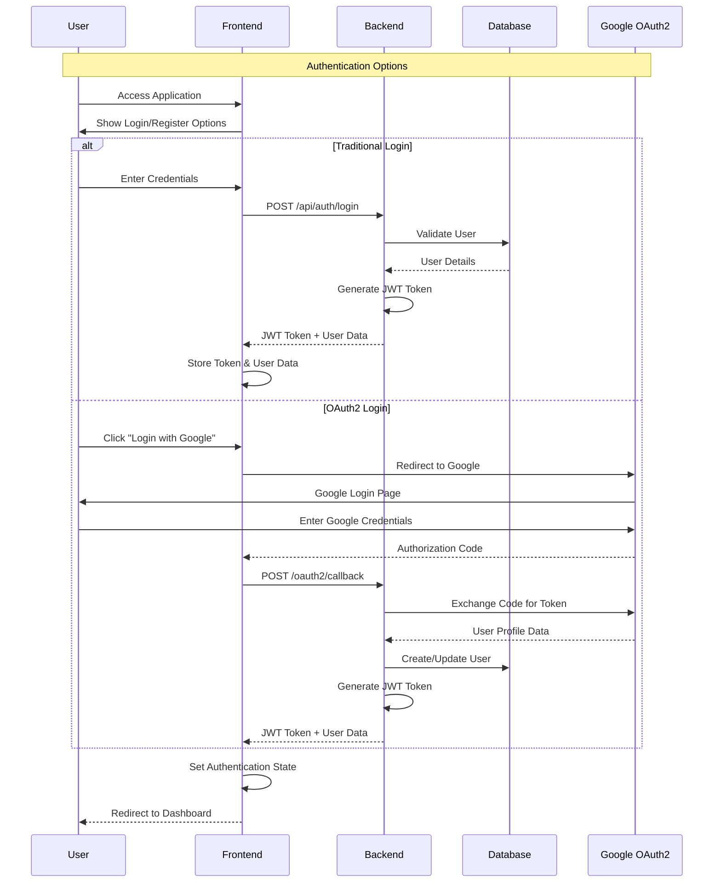
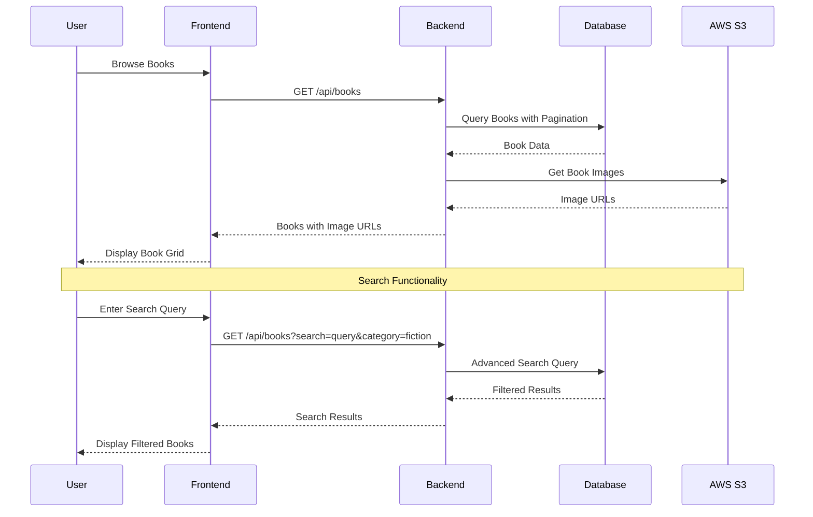
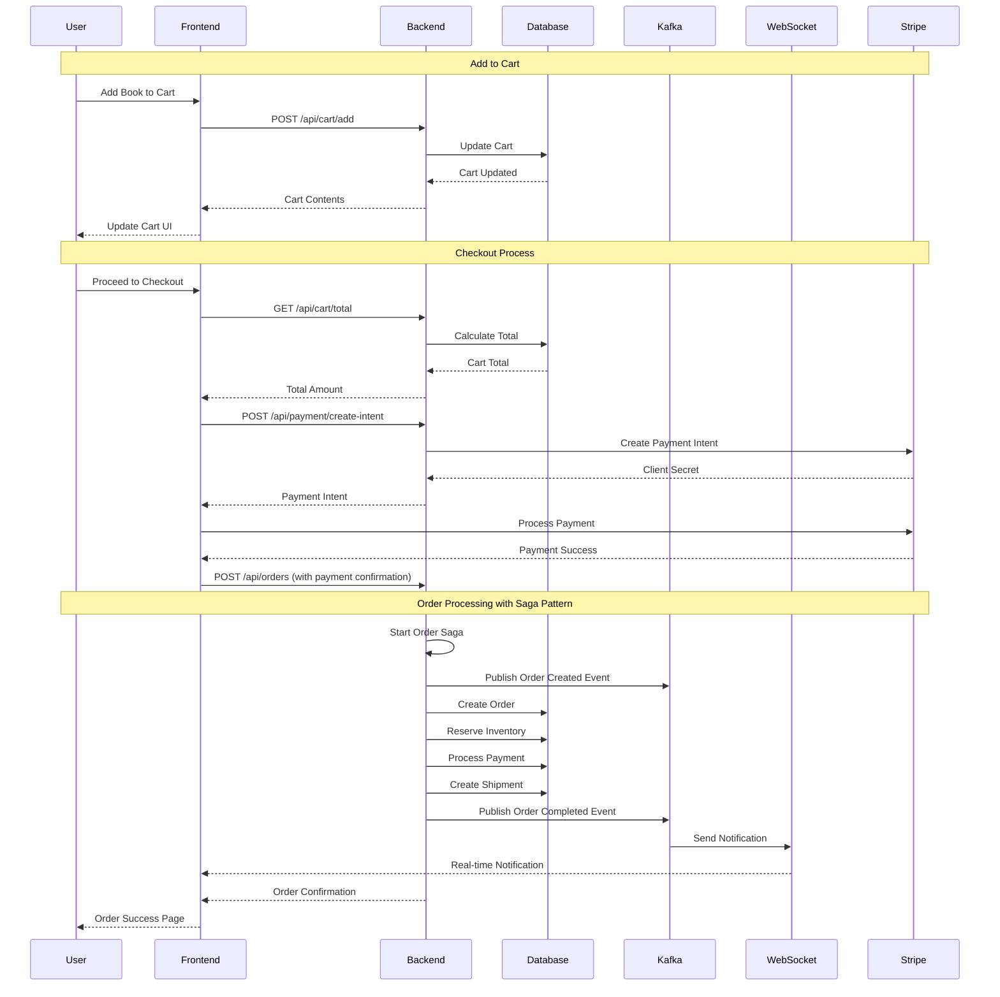
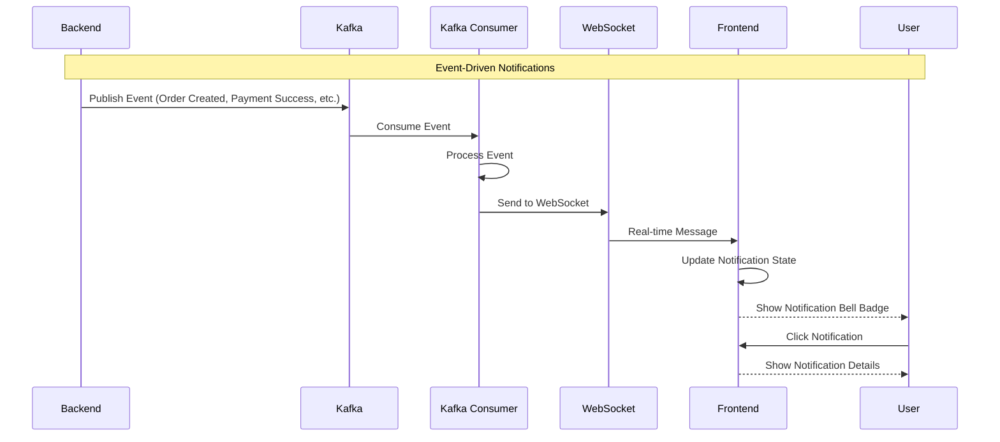

# 📚 BookStore - Complete Application Documentation

[](https://openjdk.java.net/projects/jdk/17/)
[](https://spring.io/projects/spring-boot)
[](https://reactjs.org/)
[](https://www.postgresql.org/)
[](https://www.docker.com/)
[](LICENSE)

## 🎯 **Overview**

The BookStore is a comprehensive, enterprise-grade e-commerce platform built with modern microservices architecture principles. It features a Spring Boot backend with React frontend, implementing event-driven architecture, real-time notifications, payment processing, and comprehensive admin functionality.

---

## 🏗️ **High-Level Architecture**

### **System Architecture Diagram**

```
┌─────────────────────────────────────────────────────────────────────────────────┐
│                                CLIENT LAYER                                    │
├─────────────────────────────────────────────────────────────────────────────────┤
│  React Frontend (Port 3000)                                                    │
│  ├── Material-UI Components                                                    │
│  ├── Context API State Management                                              │
│  ├── WebSocket Client (STOMP)                                                  │
│  └── Stripe Payment Integration                                                │
└─────────────────────────────────────────────────────────────────────────────────┘
                                        │
                                        │ HTTP/WebSocket
                                        ▼
┌─────────────────────────────────────────────────────────────────────────────────┐
│                              APPLICATION LAYER                                 │
├─────────────────────────────────────────────────────────────────────────────────┤
│  Spring Boot Backend (Port 8080)                                               │
│  ├── REST Controllers                                                          │
│  ├── Service Layer                                                             │
│  ├── Security (JWT + OAuth2)                                                  │
│  ├── WebSocket (STOMP)                                                         │
│  └── Event Publishing                                                          │
└─────────────────────────────────────────────────────────────────────────────────┘
                                        │
                                        │ JPA/Hibernate
                                        ▼
┌─────────────────────────────────────────────────────────────────────────────────┐
│                               DATA LAYER                                       │
├─────────────────────────────────────────────────────────────────────────────────┤
│  PostgreSQL Database (Port 5432)                                               │
│  ├── User Management                                                            │
│  ├── Book Catalog                                                              │
│  ├── Order Processing                                                          │
│  └── Saga State Management                                                     │
└─────────────────────────────────────────────────────────────────────────────────┘
                                        │
                                        │ Event Streaming
                                        ▼
┌─────────────────────────────────────────────────────────────────────────────────┐
│                            INFRASTRUCTURE LAYER                                │
├─────────────────────────────────────────────────────────────────────────────────┤
│  Apache Kafka (Port 9092)          │  Redis Cache (Port 6379)                  │
│  ├── Event Streaming               │  ├── Session Management                   │
│  ├── Order Events                  │  ├── Caching Layer                        │
│  ├── Notification Events           │  └── Performance Optimization             │
│  └── Saga Coordination             │                                           │
└─────────────────────────────────────────────────────────────────────────────────┘
                                        │
                                        │ External Services
                                        ▼
┌─────────────────────────────────────────────────────────────────────────────────┐
│                            EXTERNAL SERVICES                                   │
├─────────────────────────────────────────────────────────────────────────────────┤
│  AWS S3 Storage          │  Stripe Payment      │  Google OAuth2              │
│  ├── Book Images         │  ├── Payment Gateway │  ├── Social Login           │
│  ├── User Avatars        │  ├── Webhook Events  │  ├── User Authentication    │
│  └── File Management     │  └── Invoice Gen     │  └── Profile Integration    │
└─────────────────────────────────────────────────────────────────────────────────┘
```

### **Technology Stack**

#### **Backend Technologies**
- **Java 17** - Modern Java with latest features and performance improvements
- **Spring Boot 3.5.3** - Rapid application development framework
- **Spring Security** - Comprehensive security framework with JWT and OAuth2
- **Spring Data JPA** - Data access layer with Hibernate ORM
- **Spring Kafka** - Event streaming and messaging platform (optional)
- **Spring WebSocket** - Real-time bidirectional communication
- **Spring Mail** - Email service integration with HTML templates
- **PostgreSQL 14** - Robust relational database with ACID compliance
- **Redis 7** - In-memory data structure store for caching and sessions
- **Apache Kafka 7.4** - Distributed event streaming platform (optional)
- **AWS S3** - Scalable object storage for files and images (optional)
- **Stripe API** - Payment processing and subscription management (optional)
- **MapStruct** - Type-safe bean mapping framework
- **Lombok** - Reduces boilerplate code with annotations

#### **Frontend Technologies**
- **React 19** - Modern UI library with latest features
- **Material-UI (MUI) 7.2** - Comprehensive React component library
- **React Router v7** - Declarative routing for React applications
- **Context API** - Built-in state management solution
- **Axios** - Promise-based HTTP client for API communication
- **STOMP.js** - WebSocket messaging protocol client
- **Stripe Elements** - Secure payment form components
- **JWT Decode** - JWT token parsing and validation
- **Day.js** - Lightweight date manipulation library
- **React Slick** - Carousel component for image galleries

#### **DevOps & Infrastructure**
- **Docker** - Containerization platform
- **Docker Compose** - Multi-container application orchestration
- **Maven** - Build automation and dependency management
- **Prometheus** - Monitoring and alerting toolkit
- **Grafana** - Metrics visualization and monitoring
- **AlertManager** - Alert routing and management

---

## 🔄 **End-to-End Workflow**

### **1. User Authentication Flow**



### **2. Book Browsing and Search Flow**



### **3. Shopping Cart and Order Processing Flow**



### **4. Real-time Notification Flow**



---

## 🏛️ **Detailed Component Architecture**

### **Backend Architecture**

#### **1. Controller Layer**
The controller layer handles HTTP requests and responses, implementing RESTful API design:

```java
@RestController
@RequestMapping("/api/books")
@CrossOrigin(origins = "http://localhost:3000")
public class BookController {
    
    @GetMapping
    public ResponseEntity<List<BookDTO>> getAllBooks(
            @RequestParam(required = false) String category,
            @RequestParam(required = false) String search) {
        List<BookDTO> books = bookService.getAllBooks(category, search);
        return ResponseEntity.ok(books);
    }
    
    @PostMapping
    @PreAuthorize("hasRole('ADMIN')")
    public ResponseEntity<BookDTO> createBook(
            @Valid @RequestBody BookCreationDTO bookCreationDTO,
            @RequestParam("image") MultipartFile imageFile) {
        BookDTO book = bookService.createBook(bookCreationDTO, imageFile);
        return ResponseEntity.status(HttpStatus.CREATED).body(book);
    }
}
```

**Key Controllers:**
- **AuthUserController** - User authentication and registration
- **BookController** - Book catalog management
- **OrderController** - Order processing and management
- **PaymentController** - Payment processing with Stripe
- **AdminController** - Administrative functions
- **CartController** - Shopping cart operations
- **NotificationController** - Real-time notifications

#### **2. Service Layer**
The service layer contains business logic and orchestrates data operations:

```java
@Service
@Transactional
public class OrderServiceImpl implements OrderService {
    
    @Override
    public OrderDTO placeOrder(OrderRequestDTO orderRequest) {
        // Validate user and cart
        User user = userRepository.findById(orderRequest.getUserId())
                .orElseThrow(() -> new EntityNotFoundException("User not found"));
        
        Cart cart = cartRepository.findByUser_UserId(orderRequest.getUserId())
                .orElseThrow(() -> new IllegalStateException("Cart not found"));
        
        // Create order
        Order order = Order.builder()
                .user(user)
                .orderDate(LocalDateTime.now())
                .orderStatus(OrderStatus.NEW_ORDER.name())
                .totalAmount(orderRequest.getTotalAmount())
                .build();
        
        // Process order items
        for (CartItem cartItem : cart.getCartItems()) {
            OrderItem orderItem = OrderItem.builder()
                    .order(order)
                    .book(cartItem.getBook())
                    .quantity(cartItem.getQuantity())
                    .priceAtPurchase(BigDecimal.valueOf(cartItem.getBook().getPrice()))
                    .build();
            order.addOrderItem(orderItem);
        }
        
        Order savedOrder = orderRepository.save(order);
        
        // Publish event for saga processing
        eventPublisher.publishOrderCreatedEvent(savedOrder);
        
        return orderMapper.toDTO(savedOrder);
    }
}
```

**Key Services:**
- **BookService** - Book catalog management and search
- **OrderService** - Order processing and management
- **PaymentService** - Payment processing with Stripe
- **UserService** - User management and authentication
- **CartService** - Shopping cart operations
- **NotificationService** - Real-time notification management
- **SagaCoordinatorService** - Distributed transaction coordination

#### **3. Repository Layer**
The repository layer handles data access using Spring Data JPA:

```java
@Repository
public interface BookRepository extends JpaRepository<Book, Long> {
    
    @Query("SELECT b FROM Book b WHERE " +
           "(:search IS NULL OR LOWER(b.title) LIKE LOWER(CONCAT('%', :search, '%')) OR " +
           "LOWER(b.author.name) LIKE LOWER(CONCAT('%', :search, '%'))) AND " +
           "(:category IS NULL OR b.category.name = :category)")
    Page<Book> findBySearchAndCategory(@Param("search") String search, 
                                      @Param("category") String category, 
                                      Pageable pageable);
    
    List<Book> findByIsAvailableTrue();
    
    @Query("SELECT DISTINCT b.genre FROM Book b")
    List<String> findAllGenres();
}
```

#### **4. Model Layer (Entities)**
The model layer defines the database schema and entity relationships:

```java
@Entity
@Table(name = "users")
public class User implements UserDetails {
    
    @Id
    @GeneratedValue(strategy = GenerationType.IDENTITY)
    private Long userId;
    
    @Column(unique = true, nullable = false)
    private String userName;
    
    @Column(unique = true, nullable = false)
    private String email;
    
    @Column(nullable = false)
    private String password;
    
    @ManyToMany(fetch = FetchType.EAGER)
    @JoinTable(
        name = "user_roles",
        joinColumns = @JoinColumn(name = "user_id"),
        inverseJoinColumns = @JoinColumn(name = "role_id")
    )
    private Set<Role> roles = new HashSet<>();
    
    @OneToMany(mappedBy = "user", cascade = CascadeType.ALL, fetch = FetchType.LAZY)
    private Set<Order> orders = new HashSet<>();
    
    @OneToOne(mappedBy = "user", cascade = CascadeType.ALL, fetch = FetchType.LAZY)
    private Cart cart;
    
    // OAuth2 fields
    @Enumerated(EnumType.STRING)
    private AuthProvider provider;
    
    private String providerId;
    private String imageUrl;
}
```

### **Frontend Architecture**

#### **1. Component Structure**
The frontend follows a modular component architecture:

```
Frontend/src/
├── components/
│   ├── pages/              # Page-level components
│   │   ├── HomePage.js
│   │   ├── AllBooksPage.js
│   │   ├── BookDetailPage.js
│   │   ├── CartPage.js
│   │   └── ProfilePage.js
│   ├── admin/              # Admin-specific components
│   │   ├── AdminDashboardPage.js
│   │   ├── AdminBooksManagementPage.js
│   │   └── AdminUsersManagementPage.js
│   ├── shared/             # Reusable components
│   │   ├── Navigation.js
│   │   ├── BookCard.js
│   │   ├── NotificationBell.js
│   │   └── AppLayout.js
│   └── AppThemeProvider.js # Theme management
├── contexts/               # State management
│   ├── AuthContext.js
│   ├── CartContext.js
│   ├── NotificationContext.js
│   └── OrdersContext.js
├── services/               # API communication
│   └── api.js
└── styles/                 # Styling
    ├── components.css
    └── designSystem.css
```

#### **2. State Management with Context API**

```javascript
// AuthContext.js - Authentication state management
export const AuthProvider = ({ children }) => {
  const [isAuthenticated, setIsAuthenticated] = useState(false);
  const [user, setUser] = useState(null);
  const [loading, setLoading] = useState(true);

  const login = useCallback((token, userData) => {
    localStorage.setItem('token', token);
    localStorage.setItem('user', JSON.stringify(userData));
    setIsAuthenticated(true);
    setUser(userData);
    setLoading(false);
  }, []);

  const logout = useCallback(() => {
    localStorage.removeItem('token');
    localStorage.removeItem('user');
    setIsAuthenticated(false);
    setUser(null);
    setLoading(false);
  }, []);

  const hasRole = useCallback((roleName) => {
    const roles = user?.roles;
    if (!roles || roles.length === 0) return false;
    return roles.some(role => 
      role.authority === roleName || role.name === roleName
    );
  }, [user]);

  return (
    <AuthContext.Provider value={{
      isAuthenticated,
      user,
      loading,
      login,
      logout,
      hasRole
    }}>
      {children}
    </AuthContext.Provider>
  );
};
```

#### **3. Real-time Communication**

```javascript
// NotificationContext.js - WebSocket integration
export const NotificationProvider = ({ children }) => {
  const [notifications, setNotifications] = useState([]);
  const [isConnected, setIsConnected] = useState(false);
  const [stompClient, setStompClient] = useState(null);

  const connect = useCallback(() => {
    const token = getToken();
    if (!token || !user) return;

    const client = new Client({
      webSocketFactory: () => new SockJS('http://localhost:8080/ws'),
      connectHeaders: {
        'Authorization': `Bearer ${token}`
      },
      onConnect: (frame) => {
        setIsConnected(true);
        setStompClient(client);

        // Subscribe to user-specific notifications
        client.subscribe('/user/queue/notifications', (message) => {
          const notification = JSON.parse(message.body);
          addNotification(notification);
        });

        // Subscribe to general notifications
        client.subscribe('/topic/notifications', (message) => {
          const notification = JSON.parse(message.body);
          addNotification(notification);
        });
      },
      onStompError: (frame) => {
        console.error('STOMP error:', frame);
        setIsConnected(false);
        setTimeout(connect, 5000); // Reconnect after 5 seconds
      }
    });

    client.activate();
  }, [user, getToken]);

  useEffect(() => {
    if (isAuthenticated) {
      connect();
    }
    return () => {
      if (stompClient) {
        stompClient.deactivate();
      }
    };
  }, [isAuthenticated, connect]);
};
```

---

## 🔐 **Security Architecture**

### **Authentication & Authorization**

#### **1. JWT Token Management**

```java
@Component
public class JwtUtil {
    
    @Value("${jwt.secret}")
    private String jwtSecret;
    
    @Value("${jwt.expiration}")
    private int jwtExpiration;
    
    public String generateToken(UserDetailsImpl userDetails) {
        Map<String, Object> claims = new HashMap<>();
        claims.put("authorities", userDetails.getAuthorities());
        claims.put("userId", userDetails.getUserId());
        
        return Jwts.builder()
                .setClaims(claims)
                .setSubject(userDetails.getUsername())
                .setIssuedAt(new Date())
                .setExpiration(new Date(System.currentTimeMillis() + jwtExpiration))
                .signWith(SignatureAlgorithm.HS512, jwtSecret)
                .compact();
    }
    
    public Boolean validateToken(String token, UserDetails userDetails) {
        final String username = extractUsername(token);
        return (username.equals(userDetails.getUsername()) && !isTokenExpired(token));
    }
}
```

#### **2. Security Configuration**

```java
@Configuration
@EnableWebSecurity
@EnableMethodSecurity
public class SecurityConfig {
    
    @Bean
    public SecurityFilterChain filterChain(HttpSecurity http) throws Exception {
        http
            .csrf(csrf -> csrf.disable())
            .sessionManagement(session -> session.sessionCreationPolicy(SessionCreationPolicy.STATELESS))
            .authorizeHttpRequests(auth -> auth
                // Public endpoints
                .requestMatchers(HttpMethod.GET, "/api/books/**").permitAll()
                .requestMatchers("/api/auth/**").permitAll()
                .requestMatchers("/oauth2/**").permitAll()
                .requestMatchers("/ws/**").permitAll()
                
                // Admin endpoints
                .requestMatchers("/api/admin/**").hasRole("ADMIN")
                
                // All other endpoints require authentication
                .anyRequest().authenticated()
            )
            .oauth2Login(oauth2 -> oauth2
                .authorizationEndpoint(auth -> auth
                    .authorizationRequestRepository(authorizationRequestRepository)
                )
                .redirectionEndpoint(redirection -> redirection
                    .baseUri("/oauth2/callback/*")
                )
                .userInfoEndpoint(userInfo -> userInfo
                    .userService(customOAuth2UserService)
                )
                .successHandler(oAuth2AuthenticationSuccessHandler)
                .failureHandler(oAuth2AuthenticationFailureHandler)
            )
            .addFilterBefore(jwtRequestFilter, UsernamePasswordAuthenticationFilter.class);
        
        return http.build();
    }
}
```

#### **3. OAuth2 Integration**

```java
@Service
public class CustomOAuth2UserService implements OAuth2UserService<OAuth2UserRequest, OAuth2User> {
    
    @Override
    public OAuth2User loadUser(OAuth2UserRequest userRequest) throws OAuth2AuthenticationException {
        OAuth2UserService<OAuth2UserRequest, OAuth2User> delegate = new DefaultOAuth2UserService();
        OAuth2User oAuth2User = delegate.loadUser(userRequest);
        
        String registrationId = userRequest.getClientRegistration().getRegistrationId();
        OAuth2UserInfo userInfo = OAuth2UserInfoFactory.getOAuth2UserInfo(registrationId, oAuth2User.getAttributes());
        
        if (userInfo.getEmail().isEmpty()) {
            throw new OAuth2AuthenticationException("Email not found from OAuth2 provider");
        }
        
        User user = userRepository.findByEmail(userInfo.getEmail())
                .orElseGet(() -> createNewUser(userInfo, registrationId));
        
        return UserPrincipal.create(user, oAuth2User.getAttributes());
    }
    
    private User createNewUser(OAuth2UserInfo userInfo, String registrationId) {
        User user = new User();
        user.setUserName(userInfo.getName());
        user.setEmail(userInfo.getEmail());
        user.setImageUrl(userInfo.getImageUrl());
        user.setProvider(AuthProvider.valueOf(registrationId));
        user.setProviderId(userInfo.getId());
        user.setRoles(Set.of(roleRepository.findByName(RoleName.ROLE_USER)));
        
        return userRepository.save(user);
    }
}
```

---

## 💳 **Payment Processing System**

### **Stripe Integration**

#### **1. Payment Intent Creation**

```java
@Service
public class PaymentServiceImpl implements PaymentService {
    
    @Value("${stripe.secret.key}")
    private String stripeSecretKey;
    
    @Override
    public Map<String, String> createPaymentIntent(Long userId) throws StripeException {
        Stripe.apiKey = stripeSecretKey;
        
        // Calculate total from cart
        BigDecimal totalAmount = cartService.calculateTotalAmount(userId);
        long amountInCents = totalAmount.multiply(new BigDecimal("100")).longValue();
        
        PaymentIntentCreateParams createParams = PaymentIntentCreateParams.builder()
                .setAmount(amountInCents)
                .setCurrency("gbp")
                .setAutomaticPaymentMethods(
                    PaymentIntentCreateParams.AutomaticPaymentMethods.builder()
                        .setEnabled(true)
                        .build()
                )
                .build();
        
        PaymentIntent paymentIntent = PaymentIntent.create(createParams);
        
        Map<String, String> responseData = new HashMap<>();
        responseData.put("clientSecret", paymentIntent.getClientSecret());
        return responseData;
    }
}
```

#### **2. Payment Processing Flow**

```javascript
// Frontend Payment Processing
const handlePayment = async (paymentData) => {
  try {
    setProcessing(true);
    
    // Create payment intent
    const { data } = await api.post('/payment/create-intent', {
      userId: user.userId
    });
    
    // Confirm payment with Stripe
    const { error, paymentIntent } = await stripe.confirmCardPayment(
      data.clientSecret,
      {
        payment_method: {
          card: elements.getElement(CardElement),
          billing_details: {
            name: user.username,
            email: user.email
          }
        }
      }
    );
    
    if (error) {
      throw new Error(error.message);
    }
    
    // Process order after successful payment
    const orderResponse = await api.post('/orders', {
      userId: user.userId,
      paymentIntentId: paymentIntent.id,
      shippingAddress: shippingAddress,
      totalAmount: cartTotal
    });
    
    // Clear cart and redirect to success page
    clearCart();
    navigate('/order-success', { state: { order: orderResponse.data } });
    
  } catch (error) {
    setError(error.message);
  } finally {
    setProcessing(false);
  }
};
```

---

## 🔄 **Event-Driven Architecture**

### **Order Processing Implementation**

#### **1. Order Service**

```java
@Service
@Transactional
public class OrderServiceImpl implements OrderService {
    
    @Override
    public OrderDTO placeOrder(OrderRequestDTO orderRequest) {
        // Validate user and cart
        User user = userRepository.findById(orderRequest.getUserId())
                .orElseThrow(() -> new EntityNotFoundException("User not found"));
        
        Cart cart = cartRepository.findByUser_UserId(orderRequest.getUserId())
                .orElseThrow(() -> new IllegalStateException("Cart not found"));
        
        // Create order with all items
        Order order = Order.builder()
                .user(user)
                .orderDate(LocalDateTime.now())
                .orderStatus(OrderStatus.NEW_ORDER.name())
                .paymentMethod(orderRequest.getPaymentMethod())
                .shippingAddress(orderRequest.getShippingAddress())
                .totalAmount(orderRequest.getTotalAmount())
                .orderNumber("ORD-" + System.currentTimeMillis())
                .build();
        
        // Add order items from cart
        for (CartItem cartItem : cart.getCartItems()) {
            OrderItem orderItem = OrderItem.builder()
                    .order(order)
                    .book(cartItem.getBook())
                    .quantity(cartItem.getQuantity())
                    .priceAtPurchase(BigDecimal.valueOf(cartItem.getBook().getPrice()))
                    .build();
            order.addOrderItem(orderItem);
        }
        
        // Save order and clear cart
        Order savedOrder = orderRepository.save(order);
        cartRepository.delete(cart);
        
        // Send notifications
        sendOrderNotifications(savedOrder);
        
        return orderMapper.toDto(savedOrder);
    }
}
```

#### **2. Event Publishing**

```java
@Component
public class KafkaEventPublisher implements EventPublisher {
    
    private final KafkaTemplate<String, String> kafkaTemplate;
    private final ObjectMapper objectMapper;
    
    @Override
    public void publishOrderCreatedEvent(Order order) {
        OrderCreatedEvent event = OrderCreatedEvent.builder()
                .orderId(order.getOrderId().toString())
                .userId(order.getUser().getUserId())
                .totalAmount(order.getTotalAmount())
                .orderDate(order.getOrderDate())
                .build();
        
        publishEvent("orders.events", event);
    }
    
    @Override
    public void publishOrderStatusUpdatedEvent(Long orderId, String newStatus) {
        OrderStatusUpdatedEvent event = OrderStatusUpdatedEvent.builder()
                .orderId(orderId.toString())
                .newStatus(newStatus)
                .timestamp(LocalDateTime.now())
                .build();
        
        publishEvent("orders.events", event);
    }
    
    private void publishEvent(String topic, Object event) {
        try {
            String eventJson = objectMapper.writeValueAsString(event);
            kafkaTemplate.send(topic, eventJson);
        } catch (JsonProcessingException e) {
            throw new RuntimeException("Failed to publish event", e);
        }
    }
}
```

#### **3. Event Consumption**

```java
@Component
@ConditionalOnProperty(name = "spring.kafka.enabled", havingValue = "true")
public class NotificationKafkaConsumer {
    
    @KafkaListener(
        topics = "notifications.events",
        groupId = "notification-consumer-group"
    )
    public void consumeNotification(@Payload String message) {
        try {
            NotificationDTO notification = objectMapper.readValue(message, NotificationDTO.class);
            
            // Forward to WebSocket
            messagingTemplate.convertAndSend("/topic/notifications", notification);
            
            // Send to specific user if userId is present
            if (notification.getUserId() != null) {
                messagingTemplate.convertAndSendToUser(
                    notification.getUserId().toString(),
                    "/queue/notifications",
                    notification
                );
            }
            
        } catch (JsonProcessingException e) {
            logger.error("Failed to parse notification message", e);
        }
    }
}
```

---

## 📊 **Database Schema**

### **Core Entities and Relationships**

```sql
-- Users and Authentication
CREATE TABLE users (
    user_id BIGSERIAL PRIMARY KEY,
    username VARCHAR(45) UNIQUE NOT NULL,
    email VARCHAR(100) UNIQUE NOT NULL,
    password VARCHAR(100) NOT NULL,
    auth_provider VARCHAR(20),
    provider_id VARCHAR(100),
    image_url VARCHAR(500),
    created_at TIMESTAMP DEFAULT CURRENT_TIMESTAMP
);

CREATE TABLE roles (
    role_id BIGSERIAL PRIMARY KEY,
    name VARCHAR(20) UNIQUE NOT NULL
);

CREATE TABLE user_roles (
    user_id BIGINT REFERENCES users(user_id),
    role_id BIGINT REFERENCES roles(role_id),
    PRIMARY KEY (user_id, role_id)
);

-- Book Catalog
CREATE TABLE books (
    book_id BIGSERIAL PRIMARY KEY,
    title VARCHAR(255) NOT NULL,
    isbn VARCHAR(20) UNIQUE,
    description TEXT,
    price DECIMAL(10,2) NOT NULL,
    stock_quantity INTEGER DEFAULT 0,
    is_available BOOLEAN DEFAULT true,
    image_url VARCHAR(500),
    genre VARCHAR(100),
    publication_year INTEGER,
    created_at TIMESTAMP DEFAULT CURRENT_TIMESTAMP
);

CREATE TABLE authors (
    author_id BIGSERIAL PRIMARY KEY,
    name VARCHAR(255) NOT NULL,
    biography TEXT,
    created_at TIMESTAMP DEFAULT CURRENT_TIMESTAMP
);

CREATE TABLE publishers (
    publisher_id BIGSERIAL PRIMARY KEY,
    name VARCHAR(255) NOT NULL,
    description TEXT,
    created_at TIMESTAMP DEFAULT CURRENT_TIMESTAMP
);

CREATE TABLE book_authors (
    book_id BIGINT REFERENCES books(book_id),
    author_id BIGINT REFERENCES authors(author_id),
    PRIMARY KEY (book_id, author_id)
);

CREATE TABLE book_publishers (
    book_id BIGINT REFERENCES books(book_id),
    publisher_id BIGINT REFERENCES publishers(publisher_id),
    PRIMARY KEY (book_id, publisher_id)
);

-- Shopping Cart
CREATE TABLE carts (
    cart_id BIGSERIAL PRIMARY KEY,
    user_id BIGINT REFERENCES users(user_id) UNIQUE,
    created_at TIMESTAMP DEFAULT CURRENT_TIMESTAMP
);

CREATE TABLE cart_items (
    cart_item_id BIGSERIAL PRIMARY KEY,
    cart_id BIGINT REFERENCES carts(cart_id),
    book_id BIGINT REFERENCES books(book_id),
    quantity INTEGER NOT NULL DEFAULT 1,
    added_at TIMESTAMP DEFAULT CURRENT_TIMESTAMP
);

-- Orders
CREATE TABLE orders (
    order_id BIGSERIAL PRIMARY KEY,
    user_id BIGINT REFERENCES users(user_id),
    order_number VARCHAR(50) UNIQUE NOT NULL,
    order_date TIMESTAMP DEFAULT CURRENT_TIMESTAMP,
    order_status VARCHAR(50) NOT NULL,
    total_amount DECIMAL(10,2) NOT NULL,
    payment_method VARCHAR(50),
    shipping_address TEXT,
    created_at TIMESTAMP DEFAULT CURRENT_TIMESTAMP
);

CREATE TABLE order_items (
    order_item_id BIGSERIAL PRIMARY KEY,
    order_id BIGINT REFERENCES orders(order_id),
    book_id BIGINT REFERENCES books(book_id),
    quantity INTEGER NOT NULL,
    price_at_purchase DECIMAL(10,2) NOT NULL
);

-- Saga Pattern Tables
CREATE TABLE saga_status (
    saga_id BIGSERIAL PRIMARY KEY,
    order_id VARCHAR(100) UNIQUE NOT NULL,
    saga_type VARCHAR(50) NOT NULL,
    state VARCHAR(50) NOT NULL,
    metadata JSONB,
    created_at TIMESTAMP DEFAULT CURRENT_TIMESTAMP,
    updated_at TIMESTAMP DEFAULT CURRENT_TIMESTAMP
);

CREATE TABLE saga_events (
    event_id BIGSERIAL PRIMARY KEY,
    order_id VARCHAR(100) NOT NULL,
    step_name VARCHAR(100) NOT NULL,
    event_type VARCHAR(100) NOT NULL,
    status VARCHAR(50) NOT NULL,
    payload JSONB,
    created_at TIMESTAMP DEFAULT CURRENT_TIMESTAMP
);

-- Notifications
CREATE TABLE notifications (
    notification_id BIGSERIAL PRIMARY KEY,
    user_id BIGINT REFERENCES users(user_id),
    type VARCHAR(50) NOT NULL,
    title VARCHAR(255) NOT NULL,
    message TEXT NOT NULL,
    is_read BOOLEAN DEFAULT false,
    created_at TIMESTAMP DEFAULT CURRENT_TIMESTAMP
);

-- Favorites
CREATE TABLE user_favorites (
    user_id BIGINT REFERENCES users(user_id),
    book_id BIGINT REFERENCES books(book_id),
    added_at TIMESTAMP DEFAULT CURRENT_TIMESTAMP,
    PRIMARY KEY (user_id, book_id)
);
```

---

## 🚀 **Deployment Architecture**

### **Docker Compose Configuration**

```yaml
version: '3.8'

services:
  # Database
  postgres-db:
    image: postgres:14
    container_name: my-postgres
    ports:
      - "5432:5432"
    environment:
      POSTGRES_USER: postgres
      POSTGRES_PASSWORD: Wrong123
      POSTGRES_DB: BookStore
    volumes:
      - postgres_data:/var/lib/postgresql/data

  # Cache
  redis:
    image: redis:7
    container_name: redis_cache
    ports:
      - "6379:6379"

  # Message Broker
  zookeeper:
    image: confluentinc/cp-zookeeper:7.4.0
    container_name: zookeeper
    environment:
      ZOOKEEPER_CLIENT_PORT: 2181
      ZOOKEEPER_TICK_TIME: 2000
    ports:
      - "2181:2181"

  kafka:
    image: confluentinc/cp-kafka:7.4.0
    container_name: kafka
    depends_on:
      - zookeeper
    ports:
      - "9092:9092"
    environment:
      KAFKA_BROKER_ID: 1
      KAFKA_ZOOKEEPER_CONNECT: 'zookeeper:2181'
      KAFKA_LISTENER_SECURITY_PROTOCOL_MAP: PLAINTEXT:PLAINTEXT,PLAINTEXT_HOST:PLAINTEXT
      KAFKA_ADVERTISED_LISTENERS: PLAINTEXT://kafka:29092,PLAINTEXT_HOST://localhost:9092
      KAFKA_OFFSETS_TOPIC_REPLICATION_FACTOR: 1
      KAFKA_AUTO_CREATE_TOPICS_ENABLE: 'true'

  # Backend Application
  bookstore_springboot_app:
    build:
      context: ./
    container_name: bookstore_springboot_app
    depends_on:
      postgres-db:
        condition: service_started
      redis:
        condition: service_started
      kafka:
        condition: service_healthy
    ports:
      - "8080:8080"
    environment:
      SPRING_PROFILES_ACTIVE: docker
      # Environment variables are commented out - using hardcoded defaults

  # Frontend Application
  frontend:
    build:
      context: ./Frontend
      dockerfile: Dockerfile
    container_name: Frontend
    ports:
      - "3000:80"
    depends_on:
      - bookstore_springboot_app
    environment:
      - NODE_ENV=production
      - REACT_APP_API_BASE_URL=http://localhost:8080/api

  # Monitoring
  prometheus:
    image: prom/prometheus:latest
    container_name: prometheus
    ports:
      - "9090:9090"
    volumes:
      - ./monitoring/prometheus.yml:/etc/prometheus/prometheus.yml
    depends_on:
      - bookstore_springboot_app

  grafana:
    image: grafana/grafana:latest
    container_name: grafana
    ports:
      - "3001:3000"
    environment:
      GF_SECURITY_ADMIN_USER: admin
      GF_SECURITY_ADMIN_PASSWORD: admin123
    volumes:
      - ./monitoring/grafana/dashboards:/etc/grafana/provisioning/dashboards
    depends_on:
      - prometheus

volumes:
  postgres_data:
    driver: local
```

---

## 📈 **Performance & Scalability**

### **Caching Strategy**

```java
@Service
public class BookServiceImpl implements BookService {
    
    @Cacheable(value = "books", key = "#category + '_' + #search")
    public List<BookDTO> getAllBooks(String category, String search) {
        // Database query with caching
        return bookRepository.findBySearchAndCategory(search, category, Pageable.unpaged())
                .stream()
                .map(bookMapper::toDTO)
                .collect(Collectors.toList());
    }
    
    @CacheEvict(value = "books", allEntries = true)
    public BookDTO createBook(BookCreationDTO bookCreationDTO, MultipartFile imageFile) {
        // Create book and evict cache
        return bookMapper.toDTO(bookRepository.save(book));
    }
}
```

### **Database Optimization**

```java
@Entity
@Table(name = "books", indexes = {
    @Index(name = "idx_book_title", columnList = "title"),
    @Index(name = "idx_book_genre", columnList = "genre"),
    @Index(name = "idx_book_available", columnList = "is_available"),
    @Index(name = "idx_book_price", columnList = "price")
})
public class Book {
    // Entity definition with optimized indexes
}
```

### **Connection Pooling**

```yaml
# application.yml
spring:
  datasource:
    hikari:
      maximum-pool-size: 20
      minimum-idle: 5
      connection-timeout: 30000
      idle-timeout: 600000
      max-lifetime: 1800000
  jpa:
    properties:
      hibernate:
        jdbc:
          batch_size: 25
        order_inserts: true
        order_updates: true
```

---

## 🔧 **Configuration Management**

### **Environment-Specific Configuration**

#### **Local Development (application-local.yml)**
```yaml
spring:
  datasource:
    url: jdbc:postgresql://localhost:5432/BookStore
    username: postgres
    password: Wrong123
  jpa:
    hibernate:
      ddl-auto: update
    show-sql: true
  kafka:
    enabled: true
    bootstrap-servers: localhost:9092

jwt:
  secret: local-jwt-secret-key
  expiration: 86400000

stripe:
  secret:
    key: sk_test_local_key
  publishable:
    key: pk_test_local_key

aws:
  s3:
    bucket: local-bookstore-bucket
    region: us-east-1
```

#### **Docker Production (application-docker.yml)**
```yaml
spring:
  datasource:
    url: jdbc:postgresql://postgres-db:5432/BookStore
    username: postgres
    password: Wrong123
  kafka:
    bootstrap-servers: kafka:29092

jwt:
  secret: dGhpcy1pcy1hLXN1cGVyLXNlY3JldC1rZXktdGhhdC1pcy1tb3JlLXRoYW4tMzItYnl0ZXMhISE=
  expiration: 86400000

stripe:
  secret:
    key: your-stripe-secret-key

aws:
  s3:
    bucket: your-s3-bucket
    region: eu-north-1
```

---

## 🧪 **Testing Strategy**

### **Backend Testing**

```java
@SpringBootTest
@AutoConfigureTestDatabase(replace = AutoConfigureTestDatabase.Replace.NONE)
@Testcontainers
class OrderServiceIntegrationTest {
    
    @Container
    static PostgreSQLContainer<?> postgres = new PostgreSQLContainer<>("postgres:14")
            .withDatabaseName("testdb")
            .withUsername("test")
            .withPassword("test");
    
    @Autowired
    private OrderService orderService;
    
    @Test
    @Transactional
    void shouldPlaceOrderSuccessfully() {
        // Given
        OrderRequestDTO orderRequest = OrderRequestDTO.builder()
                .userId(1L)
                .totalAmount(new BigDecimal("29.99"))
                .paymentMethod("STRIPE")
                .build();
        
        // When
        OrderDTO result = orderService.placeOrder(orderRequest);
        
        // Then
        assertThat(result).isNotNull();
        assertThat(result.getTotalAmount()).isEqualTo(new BigDecimal("29.99"));
        assertThat(result.getOrderStatus()).isEqualTo("NEW_ORDER");
    }
}
```

### **Frontend Testing**

```javascript
// BookCard.test.js
import { render, screen, fireEvent } from '@testing-library/react';
import { BookCard } from '../BookCard';
import { CartProvider } from '../../contexts/CartContext';

const mockBook = {
  id: 1,
  title: 'Test Book',
  author: 'Test Author',
  price: 29.99,
  imageUrl: 'test-image.jpg'
};

describe('BookCard', () => {
  it('should render book information correctly', () => {
    render(
      <CartProvider>
        <BookCard book={mockBook} />
      </CartProvider>
    );
    
    expect(screen.getByText('Test Book')).toBeInTheDocument();
    expect(screen.getByText('Test Author')).toBeInTheDocument();
    expect(screen.getByText('$29.99')).toBeInTheDocument();
  });
  
  it('should add book to cart when add to cart button is clicked', () => {
    render(
      <CartProvider>
        <BookCard book={mockBook} />
      </CartProvider>
    );
    
    const addToCartButton = screen.getByText('Add to Cart');
    fireEvent.click(addToCartButton);
    
    // Verify cart context was updated
    expect(mockAddToCart).toHaveBeenCalledWith(mockBook);
  });
});
```

---

## 📊 **Monitoring & Observability**

### **Health Checks**

```java
@Component
public class DatabaseHealthIndicator implements HealthIndicator {
    
    @Autowired
    private DataSource dataSource;
    
    @Override
    public Health health() {
        try (Connection connection = dataSource.getConnection()) {
            if (connection.isValid(1)) {
                return Health.up()
                        .withDetail("database", "PostgreSQL")
                        .withDetail("validationQuery", "isValid")
                        .build();
            }
        } catch (SQLException e) {
            return Health.down()
                    .withDetail("error", e.getMessage())
                    .build();
        }
        return Health.down().build();
    }
}
```

### **Metrics Collection**

```java
@Component
public class OrderMetrics {
    
    private final Counter orderCreatedCounter;
    private final Timer orderProcessingTimer;
    private final Gauge activeOrdersGauge;
    
    public OrderMetrics(MeterRegistry meterRegistry) {
        this.orderCreatedCounter = Counter.builder("orders.created")
                .description("Number of orders created")
                .register(meterRegistry);
        
        this.orderProcessingTimer = Timer.builder("orders.processing.time")
                .description("Time taken to process orders")
                .register(meterRegistry);
        
        this.activeOrdersGauge = Gauge.builder("orders.active")
                .description("Number of active orders")
                .register(meterRegistry, this, OrderMetrics::getActiveOrdersCount);
    }
    
    public void incrementOrderCreated() {
        orderCreatedCounter.increment();
    }
    
    public void recordOrderProcessingTime(Duration duration) {
        orderProcessingTimer.record(duration);
    }
    
    private double getActiveOrdersCount() {
        // Implementation to get active orders count
        return orderRepository.countByStatusIn(List.of("NEW_ORDER", "PROCESSING"));
    }
}
```

---

## 🚀 **Quick Start Guide**

### **Prerequisites**
- Java 17 or higher
- Node.js 16 or higher
- Docker and Docker Compose
- Git

### **1. Clone and Setup**
```bash
git clone https://github.com/yourusername/BookStore.git
cd BookStore
```

### **2. Environment Configuration**
```bash
# Note: Environment variables are now commented out in configuration files
# The application uses hardcoded default values for development
# No .env file is required for basic functionality
```

### **3. Start with Docker (Recommended)**
```bash
# Start all services
docker-compose up -d

# View logs
docker-compose logs -f

# Stop services
docker-compose down
```

### **4. Manual Setup**

#### **Backend Setup**
```bash
# Build with Maven
mvn clean install

# Run Spring Boot application
mvn spring-boot:run
```

#### **Frontend Setup**
```bash
# Navigate to frontend directory
cd Frontend

# Install dependencies
npm install

# Start development server
npm start
```

### **5. Access the Application**
- **Frontend**: http://localhost:3000
- **Backend API**: http://localhost:8080
- **Admin Dashboard**: http://localhost:3000/admin
- **Database**: localhost:5432 (PostgreSQL)
- **Redis**: localhost:6379
- **Kafka**: localhost:9092
- **Prometheus**: http://localhost:9090
- **Grafana**: http://localhost:3001

---

## 🔧 **API Documentation**

### **Authentication Endpoints**
```
POST /api/auth/register     # User registration
POST /api/auth/login        # User login
GET  /api/auth/validate     # Token validation
```

### **Book Management**
```
GET    /api/books           # Get all books with filtering
GET    /api/books/{id}      # Get book by ID
GET    /api/books/search    # Search books
POST   /api/books           # Create book (Admin)
PUT    /api/books/{id}      # Update book (Admin)
DELETE /api/books/{id}      # Delete book (Admin)
```

### **Order Management**
```
GET    /api/orders          # Get user orders
POST   /api/orders          # Create order
PUT    /api/orders/{id}     # Update order status
GET    /api/orders/{id}     # Get order details
```

### **Payment Processing**
```
POST   /api/payment/create-intent    # Create Stripe payment intent
POST   /api/payment/process          # Process payment
GET    /api/payment/webhook          # Stripe webhook endpoint
```

### **Admin Endpoints**
```
GET    /api/admin/users     # Get all users
PUT    /api/admin/users/{id} # Update user role
GET    /api/admin/orders    # Get all orders
PUT    /api/admin/orders/{id} # Update order status
GET    /api/admin/dashboard # Get dashboard statistics
```

---

## 🛠️ **Development Guidelines**

### **Code Style**
- **Java**: Follow Google Java Style Guide
- **JavaScript**: Use ESLint and Prettier
- **SQL**: Use consistent naming conventions
- **Git**: Conventional commit messages

### **Branch Strategy**
- `main` - Production-ready code
- `develop` - Integration branch for features
- `feature/*` - Feature development branches
- `hotfix/*` - Critical bug fixes

### **Pull Request Process**
1. Create feature branch from `develop`
2. Implement changes with tests
3. Update documentation if needed
4. Submit pull request for review
5. Address review feedback
6. Merge after approval

---

## 🔮 **Future Roadmap**

### **Short-term (1-3 months)**
- [ ] **Advanced Search** with Elasticsearch integration
- [ ] **Mobile App** using React Native
- [ ] **Payment Webhooks** for Stripe and Razorpay
- [ ] **Advanced Analytics** dashboard
- [ ] **Multi-language Support**

### **Medium-term (3-6 months)**
- [ ] **Microservices Decomposition** into domain services
- [ ] **Kubernetes Deployment** with Helm charts
- [ ] **Advanced Caching** with Redis Cluster
- [ ] **API Rate Limiting** and throttling
- [ ] **Advanced Security** with OAuth2 Resource Server

### **Long-term (6+ months)**
- [ ] **AI-powered Recommendations** using machine learning
- [ ] **Real-time Inventory Management** with IoT integration
- [ ] **Advanced Reporting and BI** with data warehousing
- [ ] **API Marketplace** for third-party integrations
- [ ] **Blockchain Integration** for digital rights management

---

## 🤝 **Contributing**

We welcome contributions! Please see our [Contributing Guidelines](CONTRIBUTING.md) for details.

### **Development Setup**
1. Fork the repository
2. Create a feature branch
3. Make your changes
4. Add tests for new functionality
5. Submit a pull request

### **Issue Reporting**
- Use GitHub Issues for bug reports
- Provide detailed reproduction steps
- Include environment information
- Use appropriate labels

---

## 📝 **License**

This project is licensed under the MIT License - see the [LICENSE](LICENSE) file for details.

---

## 🙏 **Acknowledgments**

- **Spring Boot** team for the excellent framework
- **React** team for the amazing UI library
- **Apache Kafka** for event streaming capabilities
- **Material-UI** for the design system
- **Docker** for containerization technology
- **Stripe** for payment processing solutions

---

## 📞 **Support & Contact**

- **GitHub Issues**: [Report bugs or request features](https://github.com/yourusername/BookStore/issues)
- **Email**: govindjsg19@gmail.com
- **Documentation**: [Project Wiki](https://github.com/yourusername/BookStore/wiki)

---

<div align="center">
  <strong>Made with ❤️ by Govind Singh</strong><br>
  <em>Building the future of e-commerce, one line of code at a time.</em>
</div>
